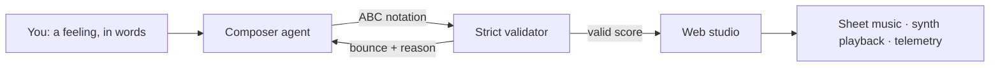

<div align="center">

# 🎼 llmcomposer

**Compose music with an LLM copilot.**

*A research exploration of cross-modal musical understanding in language
models: how well can they recreate music from text alone, and what is the
nature of their audio understanding beyond lexical description?*

[](https://github.com/alexnodeland/llmcomposer/actions/workflows/ci.yml)
[](https://alexnodeland.github.io/llmcomposer/)
[](LICENSE)
[](pyproject.toml)
[](https://github.com/astral-sh/ruff)

[Documentation](https://alexnodeland.github.io/llmcomposer/) · [Getting Started](#-quick-start) · [Research](https://alexnodeland.github.io/llmcomposer/research/) · [Related Work](https://alexnodeland.github.io/llmcomposer/related-work/)

</div>

## Table of Contents

- [🔬 Project Status](#-project-status)
- [🤔 Why llmcomposer?](#-why-llmcomposer)
- [✨ Features](#-features)
- [🏗️ Architecture](#%EF%B8%8F-architecture)
- [🚀 Quick Start](#-quick-start)
- [⚙️ Configuration](#%EF%B8%8F-configuration)
- [🧪 Research](#-research)
- [📚 Documentation](#-documentation)
- [🛠️ Development](#%EF%B8%8F-development)
- [📝 Citing](#-citing)
- [🤝 Contributing](#-contributing)
- [📄 License](#-license)

## 🔬 Project Status

llmcomposer is a **research exploration**, pre-1.0 and under active
development. It is an instrument that generates and records the data the
research questions need; **the measurements and findings are forthcoming.**
No systematic runs have been published yet, and no human evaluation has
been conducted — the
[Limitations](https://alexnodeland.github.io/llmcomposer/research/#limitations)
section says exactly what is and is not measured today. APIs and behavior
may change without notice.

## 🤔 Why llmcomposer?

Language models learn music almost entirely through text — reviews, theory,
chord charts, symbolic notation. They have (mostly) never *heard* anything.
Yet given *"like rain on a window"*, they produce scores that are
recognizably shaped by the brief.

That observation is not new — see
[Related Work](https://alexnodeland.github.io/llmcomposer/related-work/) for
the lineage (folk-rnn, Music Transformer, ChatMusician, MuPT, NotaGen) and
what those systems already measure. llmcomposer's narrow addition is the
multi-turn setting: what a model does on turn three, when told *why* its
score was rejected.

| The system provides | What that actually records |
| --- | --- |
| ABC notation as a symbolic bottleneck | Every score is committed pitches, durations, and voices — parseable, checkable, disagreeable-with |
| A strict validator with a retry loop, raising typed `ABCErrorCode`s | Which *classes* of notational error a model makes, and whether it repairs the one it was told about |
| Turn telemetry (time, requests, tokens, bounces, prompt version) | The cost of reaching a valid score, attributable to a specific prompt version |
| JSONL turn recording + an `evals/` sweep harness | A run log you can group by model, prompt, and error code — the dataset, rather than the screen |
| Symbolic descriptors over the parsed score | Pitch-class content vs. the declared key, entropy, repetition, interval spread, per-voice range |
| A deterministic offline composer | An audible floor: keyword lookup plus a seeded random walk, reproducible from the prompt alone |
| A model-agnostic agent with pinned temperature/seed | The same prompts across providers under the same sampling settings |

What it does **not** provide: any measure of musical *quality*. The
validator scores notational well-formedness only. Musical judgment is left
to a listener, and no listening study has been run yet.

You describe a feeling; a [pydantic-ai](https://ai.pydantic.dev) agent
writes and revises a tune in ABC notation; the web studio renders it as
sheet music, plays it through the abcjs synth, and grows a generative field
from the notes as they sound.

## ✨ Features

- 🎹 **Composer agent** — typed structured output (`ScoreUpdate`), dynamic
  per-turn instructions carrying the working score, typed message history
  with safe-boundary trimming.
- 📏 **Strict ABC validation** — bar durations checked against the meter
  per voice; multi-voice arrangements must align; malformed scores bounce
  back to the model with an actionable reason via `ModelRetry`.
- 🎻 **Multi-voice arrangements** — ask for *"a trio of flute, harp and
  cello"* and the agent picks a General MIDI patch per instrument with
  `%%MIDI program` directives.
- 📡 **Live composition streaming** — watch the score being written
  token-by-token, including validator bounces and rewrites, over
  server-sent events.
- 🎧 **A real player** — per-note highlighting across staves, progress bar,
  loop mode, tempo slider, instrument legend, version history, raw-ABC
  drawer, `.abc` / `.midi` export.
- 📊 **Turn telemetry** — elapsed time, request count, token spend, prompt
  version, and every validator bounce (with its error code and reason) on
  each reply.
- 🗂️ **Recording and evaluation** — set `LLMCOMPOSER_RECORD_DIR` and each
  turn appends to a JSONL run log; `evals/` holds a prompt suite, a batch
  sweep runner, and a scorer for validity, bounce, and constraint rates.
- 🔌 **Offline mode** — a `FunctionModel` composer seeded by a stable digest
  of the prompt, so the same prompt yields the same tune in any process; the
  whole stack (and the test suite) runs with no network and no credentials.

## 🏗️ Architecture



See [Architecture](https://alexnodeland.github.io/llmcomposer/architecture/)
for the full picture — including why pyabc2 and music21 were rejected in
favor of a hand-built strict parser.

## 🚀 Quick Start

```sh
uv sync

# with a real model (default: anthropic:claude-opus-5)
export ANTHROPIC_API_KEY=sk-ant-...
uv run llmcomposer

# or without any credentials, using the built-in offline composer
LLMCOMPOSER_MODEL=offline uv run llmcomposer
```

Then open <http://127.0.0.1:8000>. Chat on the left; the score appears on
the right.

## ⚙️ Configuration

| Variable | Default | Meaning |
| --- | --- | --- |
| `LLMCOMPOSER_MODEL` | `anthropic:claude-opus-5` | Any pydantic-ai model name, `litellm:<model>`, or `offline` |
| `LLMCOMPOSER_MODELS` | — | Comma-separated list offered in the studio's model selector (`offline` is always included) |
| `ANTHROPIC_API_KEY` | — | Credentials for the default Anthropic model |
| `LITELLM_BASE_URL` | — | Your LiteLLM proxy, for `litellm:` model names |
| `LITELLM_API_KEY` | — | Key for the LiteLLM proxy |
| `LLMCOMPOSER_TEMPERATURE` | — | Sampling temperature; recorded with every turn |
| `LLMCOMPOSER_SEED` | — | Sampling seed, where the provider supports one |
| `LLMCOMPOSER_RECORD_DIR` | — | When set, appends one JSONL record per turn (prompt, reply, ABC, telemetry, bounces) |
| `LOGFIRE_TOKEN` | — | Enables Logfire tracing when set |

`make run` loads `.env` automatically when one exists. Each browser gets its
own session (cookie-keyed), so concurrent users — or parallel eval workers —
never share a conversation. The model selector switches the composer
mid-collaboration: the conversation and working score carry over, so the
same tune can be revised by different models back-to-back and compared.

## 🧪 Research

The questions, the instrumentation, and — first — the
[limitations](https://alexnodeland.github.io/llmcomposer/research/#limitations)
live in
[Research](https://alexnodeland.github.io/llmcomposer/research/).
[Related Work](https://alexnodeland.github.io/llmcomposer/related-work/)
places the project against symbolic music generation (folk-rnn, Music
Transformer, MuseNet, MMM), LLMs writing ABC specifically (ChatMusician and
MusicTheoryBench, MuPT, NotaGen), and text-to-audio (MusicLM, MusicGen,
Stable Audio) — and states what is different here: interactive multi-turn
revision under critique, with a strict validator that yields a
machine-readable error taxonomy.

Batch runs live in `evals/` — a prompt suite with stable ids, a sweep
runner over models x prompts x repeats, and a scorer. Combined with
`LLMCOMPOSER_RECORD_DIR`, that is the data path from a prompt to a table.

## 📚 Documentation

Full documentation lives at
**[alexnodeland.github.io/llmcomposer](https://alexnodeland.github.io/llmcomposer/)**:
[Getting Started](https://alexnodeland.github.io/llmcomposer/getting-started/) ·
[Research](https://alexnodeland.github.io/llmcomposer/research/) ·
[Architecture](https://alexnodeland.github.io/llmcomposer/architecture/) ·
[Development](https://alexnodeland.github.io/llmcomposer/development/)

## 🛠️ Development

```sh
make ci           # exactly what CI enforces: ruff check + format, pyright strict, pytest
make check        # the everyday gate: lint, types, tests
make run-offline  # start the studio with no credentials
make docs         # serve the documentation locally
```

The test suite needs no network and no API key. See
[Development](https://alexnodeland.github.io/llmcomposer/development/) for
the quality bar and sharp edges.

## 📝 Citing

Machine-readable metadata is in [CITATION.cff](CITATION.cff) — GitHub's
"Cite this repository" button renders BibTeX and APA from it. In plain text:

> Nodeland, A. (2026). *llmcomposer* (Version 0.1.0) [Computer software].
> <https://github.com/alexnodeland/llmcomposer>

If you are citing the *findings*, wait for them — see
[Project Status](#-project-status).

## 🤝 Contributing

Contributions are welcome — see
[CONTRIBUTING](.github/CONTRIBUTING.md). Contributions that sharpen the
measurement (validator coverage, telemetry, baselines) are as welcome as
features.

## 📄 License

[MIT](LICENSE) © 2026 Alex Nodeland
