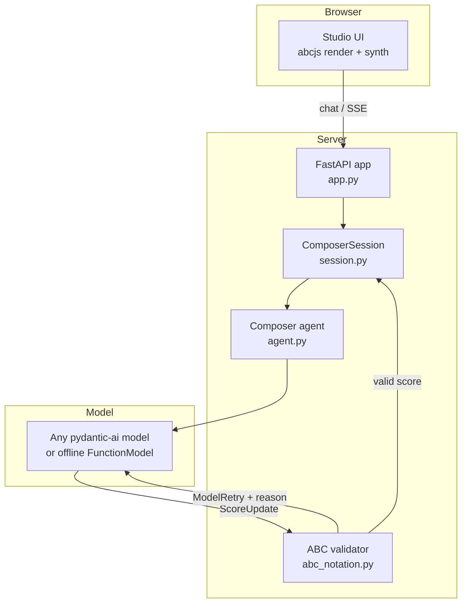

# Architecture

The interesting parts are how deeply llmcomposer leans on
[pydantic-ai](https://ai.pydantic.dev).

## The pieces

- **Typed structured output** — the agent's `output_type` is `ScoreUpdate`
  (`reply` + complete `abc`), so every turn is validated Pydantic, never
  free text (`models.py`).
- **Output validators with `ModelRetry`** — a strict ABC parser
  (`abc_notation.py`) tokenizes the tune body, checks bar durations against
  the meter per voice, and verifies all voices of an arrangement are the
  same length; malformed scores bounce back to the model with an actionable
  reason and it retries. (pyabc2 and music21 were evaluated and rejected:
  both are lenient parsers that silently swallow exactly the errors the
  retry loop needs to catch.) Every rejection carries an `ABCErrorCode`, and
  the validator records each bounce — code, message, and the rejected ABC —
  so the retry loop leaves a typed trail instead of a counter.
- **Dynamic instructions** — the working score is injected each turn via
  `@agent.instructions`, so the model always revises the same tune
  (`agent.py`).
- **Typed message history + history processors** — `ComposerSession` keeps
  the `ModelMessage` history and a processor trims old runs at safe
  boundaries (`session.py`).
- **Model-agnostic by construction** — the agent binds no model; the app
  resolves one from `LLMCOMPOSER_MODEL`, tests use `TestModel` /
  `FunctionModel` with `ALLOW_MODEL_REQUESTS = False`, and `offline.py` is
  a `FunctionModel` whose random walk is seeded from a stable digest of the
  prompt, so the whole stack runs with no network and the same prompt
  reproduces the same tune across processes and machines.
- **Per-session state** — the app keys a `ComposerSession` (and its lock) to
  a browser cookie rather than holding one global conversation, so
  concurrent users and parallel eval workers stay isolated and every
  recorded turn has a session to belong to.
- **Event-stream handler** — `ComposerSession.send_stream` passes an
  `event_stream_handler` to `agent.run`, translating pydantic-ai's
  `PartStartEvent`/`PartDeltaEvent` stream into server-sent events, so the
  UI shows the score being written token-by-token and every validator
  bounce, while retries keep their normal non-streaming semantics.
- **Logfire instrumentation** — `logfire.instrument_pydantic_ai()` is wired
  in and activates when `LOGFIRE_TOKEN` is present.

## Layout

| Path | What it is |
| --- | --- |
| `src/llmcomposer/models.py` | `ScoreUpdate` and the other Pydantic types |
| `src/llmcomposer/abc_notation.py` | The strict ABC validator |
| `src/llmcomposer/agent.py` | Agent definition, instructions, validators |
| `src/llmcomposer/session.py` | Message history, trimming, streaming |
| `src/llmcomposer/offline.py` | The deterministic offline composer |
| `src/llmcomposer/app.py` | FastAPI routes, per-cookie sessions, model resolution |
| `src/llmcomposer/templates/index.html` | The entire studio frontend (single file) |
| `src/llmcomposer/static/` | Vendored abcjs, served locally so the studio renders with no network |
| `evals/` | Prompt suite, batch sweep runner, and scorer |
