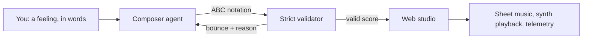

# llmcomposer

**Compose music with an LLM copilot — and record what it takes to get a
valid score out of one.**

You describe a feeling — *like rain on a window* — and a
[pydantic-ai](https://ai.pydantic.dev) agent writes and revises a tune in ABC
notation. The web studio renders it as sheet music, plays it through the
abcjs synth, and grows a generative field from the notes as they sound.

llmcomposer is a research exploration as much as an instrument. Language
models learn music almost entirely through text — reviews, theory, tabs,
symbolic notation — yet they can produce it. This project asks how far that
goes: see [Research](research.md) for the questions, the method, and — read
these first — the [limitations](research.md#limitations). Nothing has been
measured systematically yet; what exists is the apparatus.

## Where to go

- **[Getting Started](getting-started.md)** — install, run (with a real
  model or fully offline), configure.
- **[Research](research.md)** — the questions this project exists to
  explore, how the system is instrumented to explore them, and what it
  cannot tell you.
- **[Related Work](related-work.md)** — the prior art in symbolic music
  generation and LLMs writing ABC, and what is different here.
- **[Architecture](architecture.md)** — how the agent, the strict ABC
  validator, and the streaming studio fit together.
- **[Development](development.md)** — the toolchain, the quality bar, and
  how to contribute.

## At a glance

The whole stack runs with no credentials — `LLMCOMPOSER_MODEL=offline` swaps
in a composer seeded by a stable digest of your prompt (the same words give
the same tune in any process), which is also how the test suite stays fully
offline.
